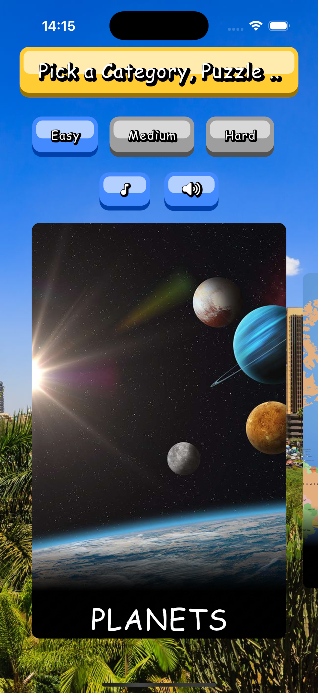
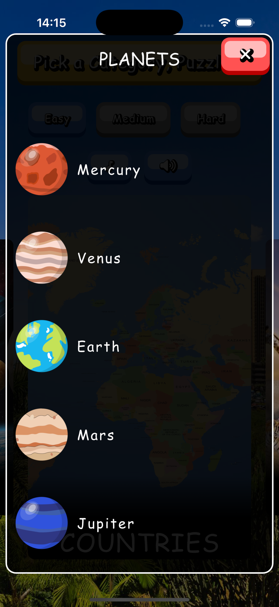
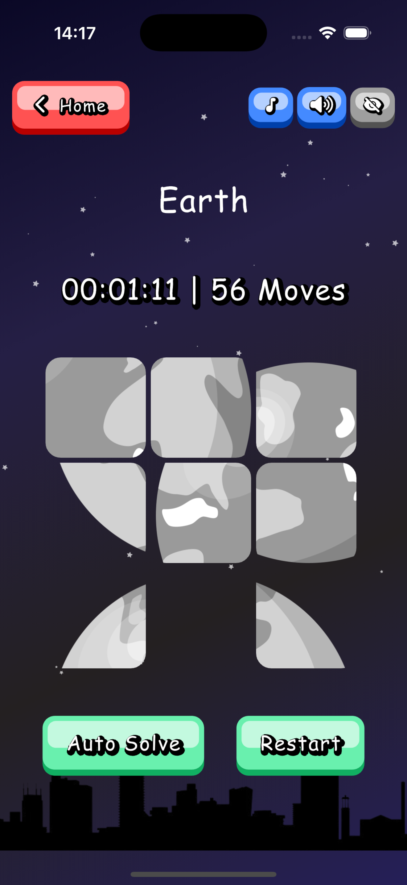
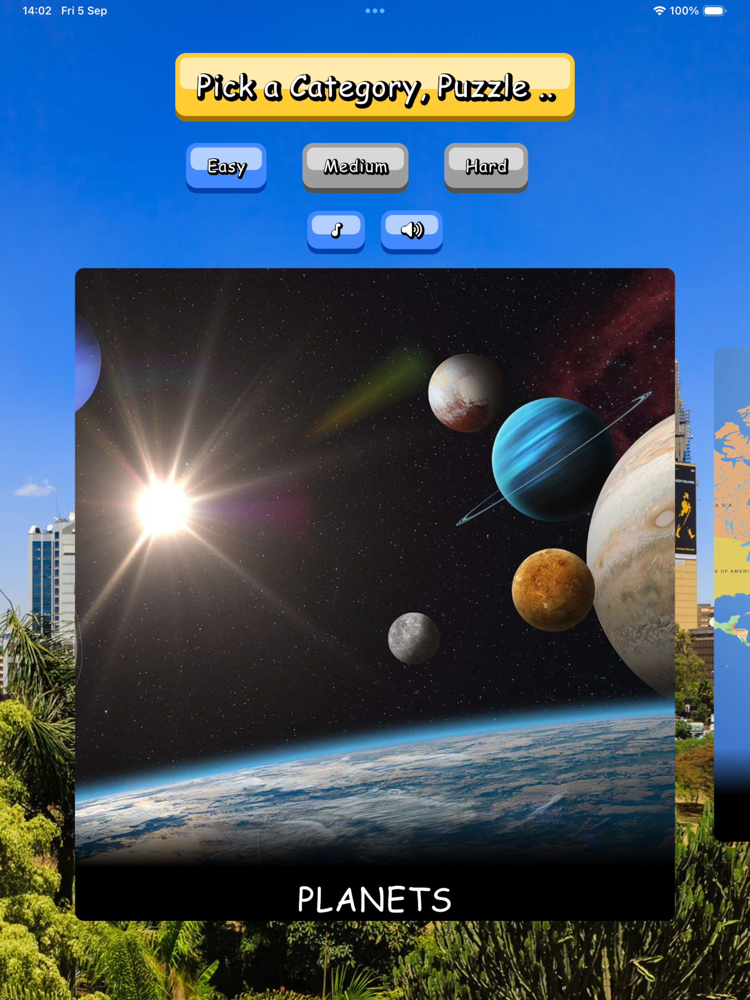
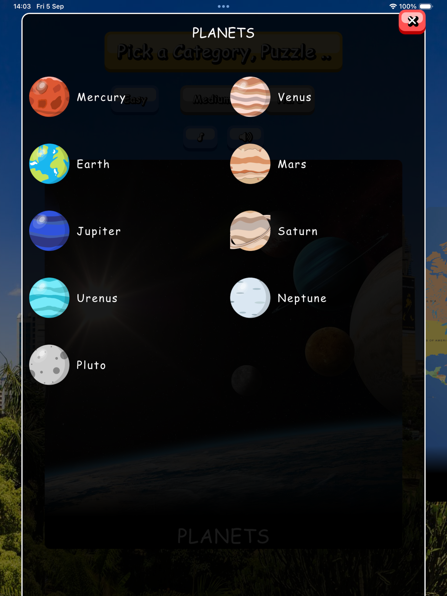
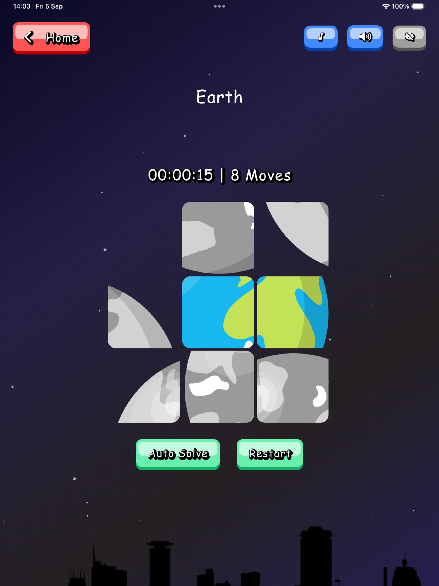

# 🌍 Tupange

*"Tupange"* is a Swahili word meaning **"let's arrange"**.

Tupange is a fun, interactive puzzle game where users rearrange shuffled image pieces to complete puzzles in the shortest time possible and with the fewest moves.

Players selects the difficulty level, a category and an item from a category and race against themselves to solve the puzzle.

---

## ✨ ScreenShots
<table>
<tr>
<td></td>
<td></td>
<td></td>
</tr>
</table>
<table>
<tr>
<td></td>
<td></td>
<td></td>
</tr>
</table>
---

## ✨ Features

* 🧩 Sliding puzzles with multiple difficulty levels.
* 🎶 Sound effects.
* 🎠 Category selection with a **carousel sliders**.
* 🌐 Internationalization support.
* 🎨 Smooth animations and UI helpers 

---

## 📦 Dependencies

This project uses a rich set of Flutter packages, including:

* **State Management**: `bloc`, `flutter_bloc`, `equatable`
* **UI & Animations**: `animated_text_kit`, `carousel_slider`, `loading_indicator`, `styled_widget`
* **Persistence**: `floor`, `sqflite`, `shared_preferences`, `path_provider`
* **Authentication**: `supabase_auth_ui`, `supabase_flutter`
* **Internationalization**: `intl`, `flutter_localizations`
* **Utilities**: `get_it`, `injectable`, `uuid`, `url_launcher`

---

## 🚀 Getting Started

### 1. Prerequisites

* [Flutter SDK](https://docs.flutter.dev/get-started/install) (latest stable)
* Dart (included with Flutter)
* An IDE such as **VS Code** or **Android Studio** or **Xcode** if you plan to build for ios

Verify setup:

```bash
flutter doctor
```

---

### 2. Clone the Repository

```bash
git clone https://github.com/SiroDevs/Tupange.git
cd Tupange
```

---

### 3. Install Dependencies

```bash
flutter pub get
```

---

### 4. Setup Environment Variables

This project uses [`flutter_dotenv`](https://pub.dev/packages/flutter_dotenv).

1. Create a `.env` file in the root directory.
2. Add your configuration (e.g., Supabase credentials):

```env
SUPABASE_URL=https://your-project.supabase.co
SUPABASE_ANON_KEY=your-anon-key
```

---

### 5. Generate Code

Run the build runner for Freezed, JSON serialization, Floor ORM, and Injectable DI:

```bash
flutter pub run build_runner build --delete-conflicting-outputs
```

---

### 6. Run the App

For Android:

```bash
flutter run
```

For iOS (ensure you’re signed into Xcode with an Apple ID):

```bash
flutter run
```

For web:

```bash
flutter run -d chrome
```

---

## 🧑‍💻 Development

### Linting

Follow recommended lints:

```bash
flutter analyze
```

### Testing

Run unit and widget tests:

```bash
flutter test
```

---

## 📱 Screenshots

*(Add your screenshots here to showcase gameplay — e.g., puzzle selection, puzzle in progress, solved state.)*

---

## 🏗 Project Structure

This project follows a **Clean Architecture + BLoC** pattern to maintain separation of concerns, testability, and scalability.

```
lib/
│── core/               # Core utilities & common definitions
│   ├── di/             # Dependency injection setup (GetIt + Injectable)
│   ├── utils/          # Utility functions & extensions
│   ├── constants/      # App-wide constants (strings, keys, assets, etc.)
│   └── helpers/        # Helper classes (e.g. formatters, validators)
│
│── data/               # Data layer (talks to APIs, DB, local storage)
│   ├── models/         # DTOs & serialization logic
│   ├── sources/        # Data sources
│   │   ├── local/      # Local storage (Floor, SharedPrefs, etc.)
│   │   └── remote/     # Remote APIs (Supabase, HTTP clients, etc.)
│
│── domain/             # Business logic layer
│   ├── entities/       # Pure Dart objects (business models)
│   └── repositories/   # Abstract contracts for data access
│
│── presentation/       # UI layer
│   ├── blocs/          # BLoC state management
│   ├── cubits/         # Cubit state management
│   ├── widgets/        # Reusable UI components
│   ├── screens/        # App screens/pages
│   └── themes/         # Styling, themes, and text styles
│
│── app.dart            # Root widget & app configuration
│── main.dart           # Entry point of the application
```

### 🔑 Layered Responsibilities

* **Core** → Independent utilities and app-wide definitions.
* **Data** → Responsible for fetching, caching, and storing data. Converts raw data into domain entities.
* **Domain** → Defines the business logic with entities and repository contracts. Contains no Flutter imports.
* **Presentation** → Handles UI and state management (BLoC/Cubit). Connects domain logic to the user interface.

---

## 🌍 Internationalization

The app supports localization with `intl` and `flutter_localizations`.
Add new translations in the `l10n` folder.

---

## 🔒 Authentication

Supabase is integrated for authentication.

* Prebuilt UIs: `supabase_auth_ui`
* Full backend support: `supabase_flutter`

---

## 🤝 Contributing

1. Fork the project
2. Create your feature branch (`git checkout -b feature/new-feature`)
3. Commit changes (`git commit -m "Add new feature"`)
4. Push to the branch (`git push origin feature/new-feature`)
5. Open a Pull Request

---

## 📄 License

This project is licensed under the MIT License. See [LICENSE](./LICENSE) for details.
